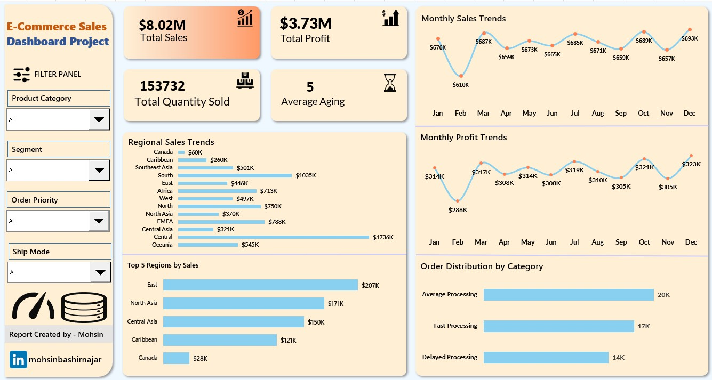

# Interactive E-Commerce Sales Dashboard in Excel | Data-Driven Insights & Automation

**Short summary:** Built an Excel-based interactive dashboard to analyze sales & profit trends by month, region, and product category. Includes dynamic filters, pivot tables, and automated reporting.

## Project Highlights
- **Analyzed:** 5K+ transactions to surface month-wise and region-wise trends.
- **Dashboard:** Interactive combo-box driven Excel dashboard with PivotTables & charts.
- **Impact:** Automated reporting, reducing manual work by 45%.

## Files
- `workbook/E-Commerce Dashboard dataset.xlsx` — (sample or link)
- `docs/screenshots/` — dashboard previews
## Tools & Techniques
Excel, Pivot Tables, Combo Boxes, Charts, Data Analysis Add-in, (optional) Python automation for reporting.

## How to view
1. Download the workbook from `workbook/` or the Release.
2. Open in Microsoft Excel; enable macros if required.

## License
MIT License — see LICENSE file.

## Contact
Mohsin Bashir — [LinkedIn](https://www.linkedin.com/in/mohsinbashirnajar/)
